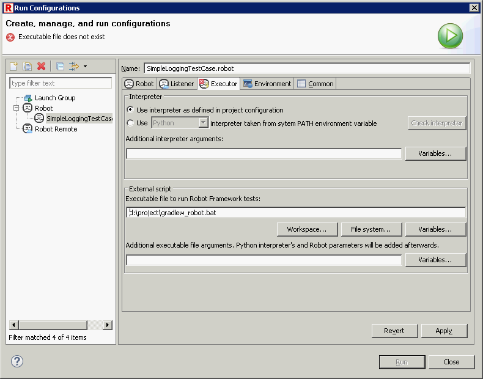
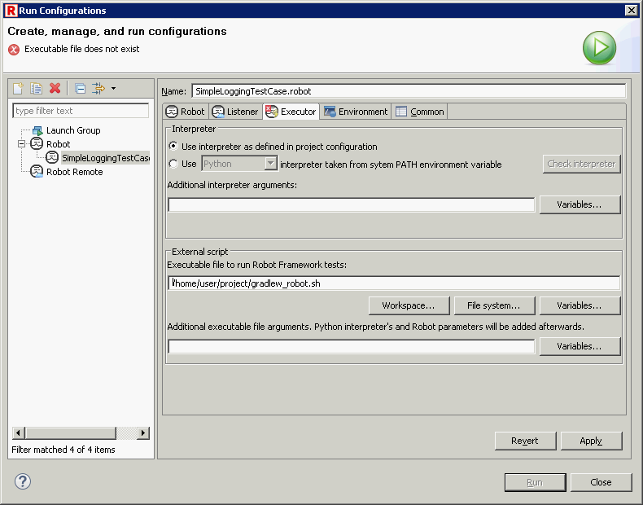

[RED - Robot Editor User Guide](http://nokia.github.io/RED/help/index.md) >
[User guide](http://nokia.github.io/RED/help/user_guide/user_guide.md) >
[Integration with other
tools](http://nokia.github.io/RED/help/user_guide/tools_integration.md) >

## Running tests using Gradle

It is possible to run Robot tests from RED by launching them through script.
There are at least two different possibilities for running the tests from
inside of [Gradle](https://gradle.org/) building script:

  1. by explicitly running Python interpreter passing required arguments for robot
  2. by using some Gradle plugin which will use Standalone Robot JAR distribution obtained from repository (see [RF help topic about standalone JAR](http://robotframework.org/robotframework/latest/RobotFrameworkUserGuide.html#standalone-jar-distribution)) 

The first possibility requires having some python interpreter with RF
installed (CPython, PyPy, Jython, IronPython) while the latter only requires
Java (which anyway has to be installed in order to run Gradle).

### Simple Gradle script running external interpreter

We will use following simple script in order to run interpreter from RED:

` task runRobot(type:Exec) {  
    executable robotExec  
    args Eval.me(robotArguments)  
} `

the task above expects two arguments: path to interpreter executable and a
list of it's arguments written in a form: `['arg1', 'arg2', ..., 'arg_n']`

When launching the test RED does not pass arguments in form like above,
moreover Gradle passes arguments mostly using it's own syntax: `-Parg=val`.
Because of this we need to create own script which will perform arguments
translation (or modify Gradle Wrapper script).

Script available on GitHub: [
https://github.com/nokia/RED/tree/master/src/RobotUserScripts](https://github.com/nokia/RED/tree/master/src/RobotUserScripts)

  * **Windows batch script** \- `gradlew_robot.bat`

@echo off  
set FIRST="true"  
set EXEC=%1  
set RF_ARGS=[  
shift  
  
:loop1  
if "%1"=="" goto after_loop  
if %FIRST%=="true" (  
    set RF_ARGS=%RF_ARGS%'%1'  
) else (  
    set RF_ARGS=%RF_ARGS%, '%1'  
)  
shift  
set FIRST="false"  
goto loop1  
  
:after_loop  
set RF_ARGS=%RF_ARGS:\=/%]  
  
call gradlew.bat runRobot -ProbotExec=%EXEC% -ProbotArguments="%RF_ARGS%"  

  * **Linux bash script** \- `gradlew_robot.sh`

#!/usr/bin/env bash  
  
first=1  
exec=$1  
restvar="["  
  
shift  
for var in "$@"  
do  
    if [ $first -eq 1]; then  
        restvar="$restvar'$var'"  
    else  
        restvar="$restvar,'$var'"  
    fi  
    first=0  
done  
restvar="$restvar]"  
  
./gradlew runRobot -ProbotExec=$exec -ProbotArguments=$restvar  

It is now possible to run tests with the script above: create Robot launch
configuration and set executable file at **Executor** tab and launch the tests
as depicted on images below.

Note

    Instead of specifying script at **Executor** tab manually it is possible to define default value of executor script path in Preferences (at `[ Window -> Preferences -> Robot Framework -> Default Launch Configurations ](javascript:executeCommand\('org.eclipse.ui.window.preferences\(preferencePageId=org.robotframework.ide.eclipse.main.plugin.preferences.launch.default\)'\))` set **Executable file** to desired executable). Now every time new launch configuration is created it will use given executable by default. 

### Gradle scripts running Standalone JAR distribution

Running the tests through Gradle plugin which uses standalone JAR is very
similar to running the tests using external interpreter, the only thing is
that the script has to translate arguments into a form which is used by the
plugin, which may of course vary depending on Gradle plugin in use. The
batch/bash scripts from above may be adapted and used when calling tests this
way.

Warning

    As for now RED cannot use Standalone JAR distribution of RF as environment, so while it would possible to run the tests using (2) method it is currently not possible to have other features of RED like validation, code assistance etc. working without having python interpreter installed. 

