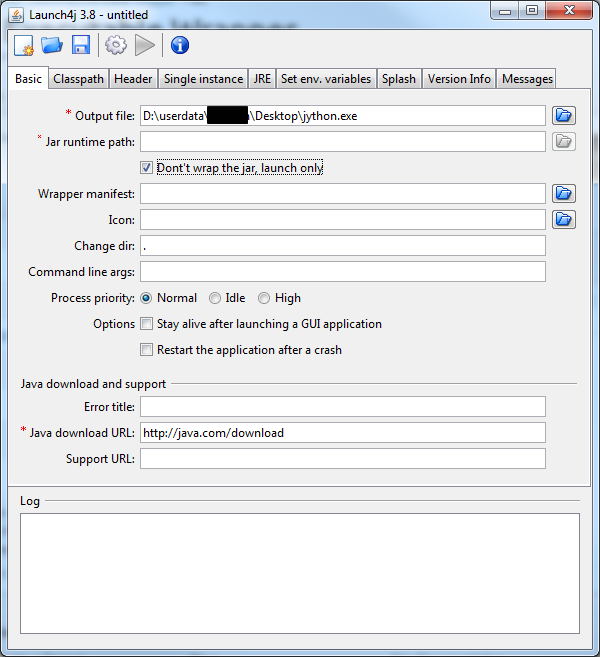
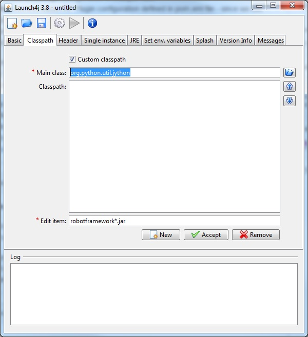
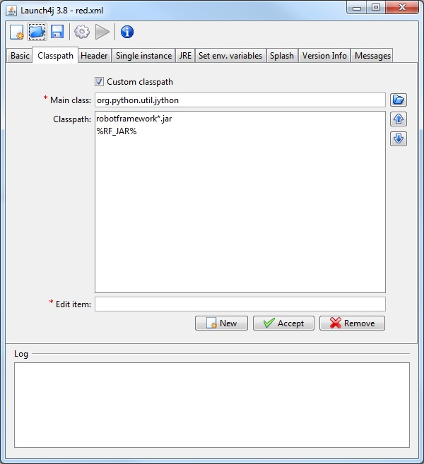
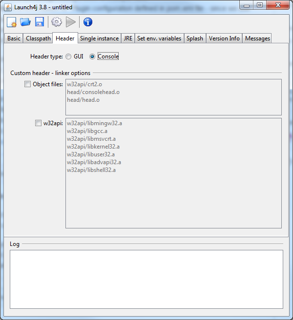
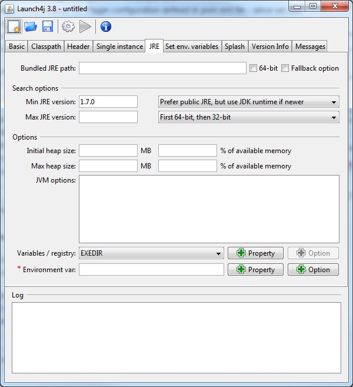
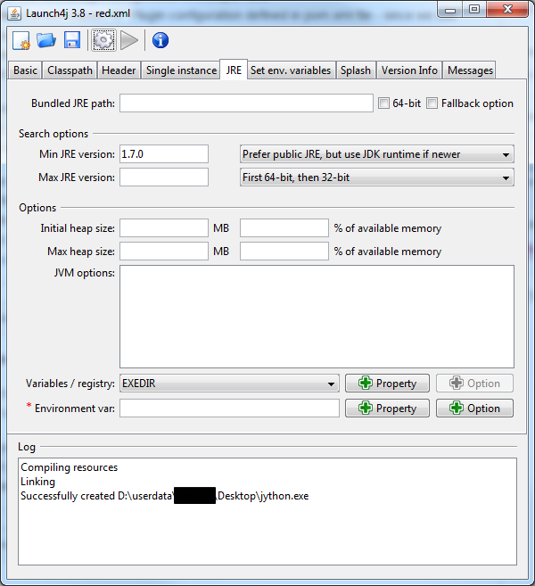

[RED - Robot Editor User Guide](http://nokia.github.io/RED/help/index.md) >
[User guide](http://nokia.github.io/RED/help/user_guide/user_guide.md) >
[Integration with other
tools](http://nokia.github.io/RED/help/user_guide/tools_integration.md) >

## How to integrate RED with Robotframework Maven Plugin

  * Download from [launch4j](http://sourceforge.net/projects/launch4j/files/launch4j-3/3.8/) applicable for your OS package - we will use launch4j-3.8-win32.zip (it is standalone version, which requires only unzip) 
  * Run _launch4j.exe_ GUI application 
  * In Basic tab set _Output file:_ to be jython.exe application, the location and select _Dont't wrap the jar, launch only_. 

  * In Classpath tab switch on _Custom classpath_ and set _Main class:_ to org.python.util.jython.   
In _Edit item_ : put robotframework*.jar and press Accept button.  
Repeat this to add %RF_JAR% variable.

  * In Header tab just switch _Header type_ from GUI to Console. 

  * In JRE tab put in Min JRE version value 1.7.0. 

  * In main menu press _Build wrapper_ (gear icon). The application will ask you for save configuration, it is required - the name of configuration and place where it will be located is optional. 
  * If everything was done ok you will be able to see in Log text area information about Successfully created file.   

The created _jython.exe_ file has to two possibilities to set
_robotframework*.jar_ location:

  1. via already set variable %RF_JAR% you can set it in _System Variables_
  2. using jar located in the same directory where jython.exe file is present

The last test before integration with RED - is to test if executable file was
compiled ok and will work.

Execute in command line:

set RF_JAR=D:\userdata\RED\Desktop  
set
RF_JAR=C:\Users\RED\\.m2\repository\org\robotframework\robotframework\3.0\robotframework-3.0.jar  
jython.exe -m robot.run --version

If output looks like: Robot Framework 3.0 (Jython 2.7.0 on java1.*) it means
that you can integrate jython.exe with RED.

To integrate jython.exe with RED:

  1. put _jython.exe_ file to bin directory. It can be anywhere, but parent folder must be named as bin - i.e. _C:\bin\_
  2. It is easier to copy robotframework*.jar to this bin directory instead of set RF_JAR environment variable
  3. run _eclipse.exe_ or _RED.exe_ depends on which RED version you are using 
  4. go to `[ Window -> Preferences -> Robot Framework -> Installed frameworks](javascript:executeCommand\('org.eclipse.ui.window.preferences\(preferencePageId=org.robotframework.ide.eclipse.main.plugin.preferences.installed\)'\))`
  5. click _Add..._ button and select bin directory from 1. 
  6. if everything is ok, information about Robot Framework version should be visible
  7. when you will create RED project or execute Clean\Build, you should see in Robot Standard libraries standard libraries like i.e. BultIn with information about keywords, which they contains.

