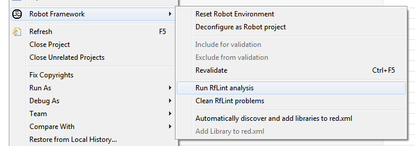
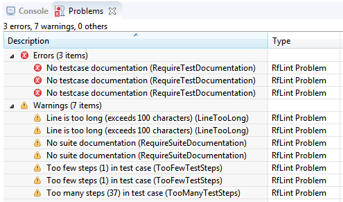
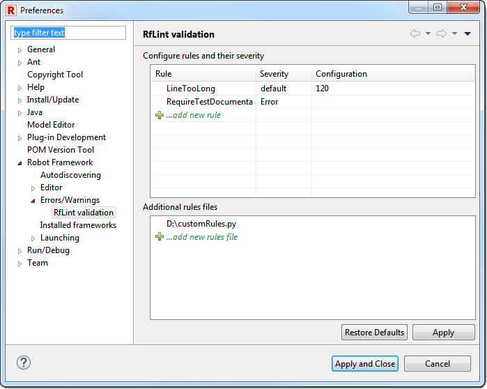

[RED - Robot Editor User Guide](http://nokia.github.io/RED/help/index.md) >
[User guide](http://nokia.github.io/RED/help/user_guide/user_guide.md) >
[Integration with other
tools](http://nokia.github.io/RED/help/user_guide/tools_integration.md) >

## Robot Framework Lint analysis

Starting with RED 0.8.1 it is possible to run [Robot Framework
Lint](http://github.com/boakley/robotframework-lint/) analysis tool. Of course
one have to have it installed in the python installation used by the project.

### Running RfLint

RfLint can be run on selected file or folder (or whole project) in **Project
Explorer** view. In order to start analysis open context menu for selected
resource and choose **`Robot Framework -> Run RfLint analysis`**.

The analysis should start and its progress is visible in **Progress** view. At
any time you can abort running validation:

Analysis performed from RED is reporting all the findings as **Problem
markers** of a separate type called **RfLint Problem**. This is a different
type than those reported by standard RED [ validation](../validation.md)
mechanism (they have **Robot Problem** type). Overall this means that the
findings are visible in **Problems** view and are also visible in editors.

In order to remove problems simply choose **`Robot Framework -> Clean RfLint
problems`** from context menu of selected resource.

Note

    Robot Framework Lint analysis is not run on excluded project parts (see more under topic [Limiting validation scope](../validation/scope.md). 

### Configuration

It is possible to configure RfLint behavior in Preferences ( `[ Window ->
Preferences -> Robot Framework -> Errors/Warnings -> RfLint
validation](javascript:executeCommand\('org.eclipse.ui.window.preferences\(preferencePageId=org.robotframework.ide.eclipse.main.plugin.preferences.rflint\)'\))`)

  * rule **severity** \- rule of a given name can have severity specified: **default** means severity is unchanged, **Error** and **Warning** changes severity to one of those levels, while **Ignore** will silence the rule, 

  * rule **configuration** \- as described in [RfLint Wiki](http://github.com/boakley/robotframework-lint/wiki/How-to-write-custom-rules) some rules can be configured. This can be done on preference page. Simply write arguments for given rule. If there are multiple arguments then they should be separated with colon (:) character, 

  * **additional rules files** \- add python files containing custom RfLint rules so that they will be also used for analysis. 

  * **additional arguments** \- custom RfLint arguments that will be used for analysis 

Note

    Additional arguments field accepts Eclipse [string variables](../launching/string_substitution.md).

